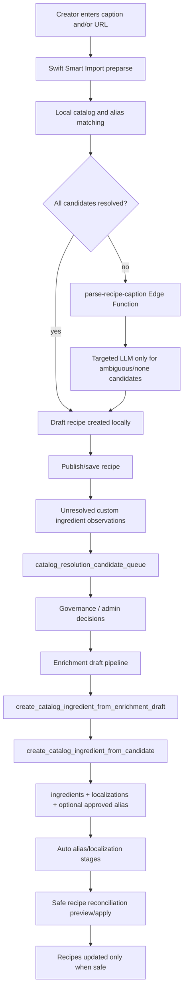

# Season Smart Import and Catalog Intelligence Pipeline

This document is the source of truth for the end-to-end pipeline that starts with Smart Import and ends with governed catalog updates and safe recipe reconciliation.

It complements `docs/catalog-architecture.md`. That document defines canonical ingredient identity. This document defines how import, observation, governance, creation, aliasing, automation, and reconciliation interact.

## 1. Vision

Season must make recipe import fast for creators without letting free-text input corrupt the canonical ingredient catalog.

The system therefore separates two jobs:

- Consumer paths resolve against existing approved catalog knowledge.
- Governance paths create or change catalog knowledge through auditable backend-controlled workflows.

Smart Import is allowed to parse, normalize, match, and produce draft ingredients. It is not allowed to create canonical ingredients or approve aliases. Catalog Intelligence is allowed to review unresolved observations, propose enrichment, create canonical ingredients, approve aliases, and reconcile existing recipe ingredients when safety checks pass.

The core invariant is:

`public.ingredients` is the canonical identity model, and `public.create_catalog_ingredient_from_candidate(...)` is the single canonical writer for new ingredient identity.

## 2. System Overview



Primary runtime surfaces:

- Swift preparse and local matching: `Season/Services/SocialImportParser.swift`
- Smart Import UI and final draft mapping: `Season/Views/CreateRecipeView.swift`
- Import-oriented catalog resolution: `ProduceViewModel.resolveIngredientForImport(...)`
- Smart Import Edge Function: `supabase/functions/parse-recipe-caption`
- Candidate queue: `public.catalog_resolution_candidate_queue`, `public.catalog_resolution_candidates(...)`
- Governance decisions: `public.apply_catalog_candidate_decision(...)`
- Enrichment proposal: `supabase/functions/catalog-enrichment-proposal`
- Enrichment batch: `supabase/functions/run-catalog-enrichment-draft-batch`
- Canonical creation batch: `supabase/functions/run-catalog-ingredient-creation-batch`
- Automation cycle: `supabase/functions/run-catalog-automation-cycle`
- Single canonical writer: `public.create_catalog_ingredient_from_candidate(...)`
- Draft wrapper: `public.create_catalog_ingredient_from_enrichment_draft(...)`
- Alias table: `public.ingredient_aliases_v2`
- Reconciliation apply: `public.apply_recipe_ingredient_reconciliation_modern(...)`

### Current Reality vs Target Architecture

Current reality:

- Recipe ingredients still coexist in legacy-compatible shapes: `produceID`, `basicIngredientID`, `ingredientID`, and custom names.
- Smart Import writes draft recipe data in the existing Swift model. It does not write canonical catalog data.
- `parse-recipe-caption` can improve import output, but its output remains recipe draft data, not catalog truth.
- Canonical ingredient creation is now centralized through `create_catalog_ingredient_from_candidate(...)`, with ready-draft creation delegated through `create_catalog_ingredient_from_enrichment_draft(...)`.
- Alias writes are still available through multiple governed paths. They are not yet unified behind one alias writer.
- Recipe reconciliation is selective and safe-by-preview. It does not bulk rewrite every custom ingredient.

Target architecture:

- New canonical ingredient identity is created only by the single writer.
- Import and recipe rendering consume canonical/alias knowledge but do not author it.
- Alias approval and canonical creation remain separate decisions.
- Existing recipe data migrates gradually toward canonical `ingredient_id` without breaking legacy compatibility.
- Automation reduces operator workload only inside explicitly safe, auditable boundaries.

## 3. Layer Responsibilities

### Swift Smart Import

Does:

- Accepts caption-only, URL-only, or caption+URL input.
- Extracts candidate ingredient lines deterministically.
- Recovers basic quantity/unit patterns.
- Attempts local matching against loaded produce, basic ingredients, unified catalog names, and approved aliases.
- Produces `SmartImportIngredientCandidate` values with `matchType`, optional matched ingredient id, and confidence.
- Builds draft recipe ingredients in the existing Swift-compatible recipe model.
- Emits unresolved custom ingredient observations after publish/save when final ingredients remain custom.

Must not:

- Create rows in `public.ingredients`.
- Approve or mutate `ingredient_aliases_v2`.
- Treat LLM output as canonical identity.
- Change recipe reconciliation state directly.

### `parse-recipe-caption` Edge Function

Does:

- Requires authenticated user context.
- Accepts `caption`, optional `url`, `languageCode`, and optional `ingredientCandidates`.
- If candidates are present, calls LLM only for candidates that require it: ambiguous or none, plus low-confidence alias when applicable.
- Returns existing-compatible recipe parse output.
- Adds optional audit metadata without requiring Swift contract changes.

Must not:

- Create canonical ingredients.
- Approve aliases.
- Write catalog governance decisions.
- Apply recipe reconciliation.

### Candidate Queue and Observations

Does:

- Aggregates unresolved custom ingredient observations.
- Exposes candidates through `catalog_resolution_candidate_queue` and `catalog_resolution_candidates(...)`.
- Provides deterministic suggested actions such as `alias_existing`, `create_new_ingredient`, `ignore`, and `unknown`.

Must not:

- Create catalog entities automatically.
- Assume a candidate recommendation is an approval.
- Mutate recipe ingredients.

### Governance / Admin Decisions

Does:

- Persists reviewed decisions through `apply_catalog_candidate_decision(...)`.
- Supports `approve_alias`, `reject_alias`, `create_new_ingredient`, and `ignore`.
- Updates observation status and appends audit rows in `catalog_candidate_decisions`.

Must not:

- Use app UI checks as the only authorization boundary.
- Create ingredients as a side effect of `create_new_ingredient`; that action only marks the observation as a candidate for creation.
- Run recipe reconciliation as part of candidate triage.

### Enrichment Draft Pipeline

Does:

- Uses `catalog-enrichment-proposal` to generate structured draft proposals.
- Stores proposals in `catalog_ingredient_enrichment_drafts`.
- Validates draft readiness with backend validation functions.
- Marks drafts `ready` only when required fields and rules pass.

Must not:

- Insert directly into `ingredients`.
- Treat an LLM proposal as approved canonical truth.
- Bypass validation at creation time.

### Canonical Creation

Does:

- Creates or reuses canonical ingredient identity through `create_catalog_ingredient_from_candidate(...)`.
- Allows `create_catalog_ingredient_from_enrichment_draft(...)` to validate ready drafts and delegate to the canonical writer.
- Allows `run-catalog-ingredient-creation-batch` to batch ready drafts by calling the draft wrapper.

Must not:

- Re-implement ingredient insertion in Edge Functions.
- Create canonical ingredients outside the single writer.
- Split canonical identity across produce/basic/custom systems.

### Alias System

Does:

- Maps normalized free text to canonical ingredient ids.
- Stores approval state, activation state, source, confidence, reviewer metadata, and audit context.
- Supports manual approval and safe auto-approval through governed RPCs.

Must not:

- Substitute for canonical creation when a genuinely new culinary identity is needed.
- Create new canonical ingredient nodes.
- Point one active normalized alias to multiple canonical targets.

### Recipe Reconciliation

Does:

- Uses safe preview/apply paths to update existing recipes when unresolved custom ingredients can be mapped to approved aliases or canonical localizations.
- Skips already resolved recipe ingredient rows.
- Writes reconciliation audit records.

Must not:

- Create canonical ingredients.
- Approve aliases.
- Guess ambiguous ingredient identity.
- Mutate recipes outside `safe_to_apply` criteria.

### Authority Rules

Authority is assigned by workflow, not by confidence score.

- A high confidence value can prioritize review, but it is not approval.
- An LLM proposal can populate a draft, but it is not canonical truth.
- A candidate queue recommendation can suggest an action, but it is not a decision.
- A Smart Import match can resolve a draft ingredient, but it is not permission to mutate catalog tables.
- An alias can map text to an ingredient only after it is approved/active or already present in trusted local catalog data.
- A canonical ingredient exists only after the canonical writer creates or reuses it.
- A recipe ingredient is reconciled only after the reconciliation safety view marks it safe and the apply RPC updates it.

Operational rule:

If a path does not pass through the relevant governed writer or apply RPC, it is advisory only.

## 4. Data Contracts

### Smart Import Candidate Match Types

`exact`

The candidate maps directly to an existing known ingredient identity with high confidence. This can be resolved locally and should not require LLM.

`alias`

The candidate maps through an alias-like match. High-confidence alias candidates can be treated as locally resolved. Low-confidence alias candidates may require LLM help for import output, but LLM output still does not become canonical truth.

`ambiguous`

The candidate has multiple plausible targets or insufficient confidence to choose one deterministically. It may be sent to the Edge Function/LLM for draft import assistance. It must not be auto-written as canonical.

`none`

No safe local match exists. It may be sent to the Edge Function/LLM for draft import assistance and may later become an unresolved observation if it remains custom.

### Smart Import Ingredient Output Status

`resolved`

The final imported ingredient was resolved from existing local/catalog/alias knowledge.

`inferred`

The final imported ingredient needed LLM assistance for import output. This is draft confidence only, not catalog approval.

`unknown`

The system could not resolve or infer a useful canonical target. The ingredient should remain custom/unresolved and be eligible for observation.

### Safe Target States for Import

`resolved_to_existing_canonical`

The import maps to an existing canonical ingredient through deterministic matching.

`resolved_via_existing_alias`

The import maps to an existing canonical ingredient through an approved or locally known alias.

`unresolved_candidate`

The import remains custom after draft mapping and can feed `custom_ingredient_observations`.

`unknown_do_not_guess`

The input is too ambiguous or noisy. It should remain custom or be ignored by governance later.

## 5. Canonical Creation Rules

The single canonical writer is:

```sql
public.create_catalog_ingredient_from_candidate(...)
```

This RPC is responsible for:

- validating required creation inputs,
- detecting existing canonical matches by slug, localization, and approved alias coverage,
- inserting `public.ingredients` only when no existing canonical match is found,
- inserting/updating `public.ingredient_localizations`,
- optionally inserting/updating an approved alias,
- updating observation status,
- appending `catalog_candidate_decisions` audit rows.

Allowed callers:

- Manual/admin workflows that have reviewed a candidate.
- `create_catalog_ingredient_from_enrichment_draft(...)`, after draft validation.
- `run-catalog-ingredient-creation-batch`, indirectly through the draft wrapper.

Not allowed:

- `parse-recipe-caption`
- Swift Smart Import
- direct Edge Function inserts into `public.ingredients`
- direct client writes into canonical catalog tables

Current delegation chain:

```text
run-catalog-ingredient-creation-batch
-> create_catalog_ingredient_from_enrichment_draft
-> create_catalog_ingredient_from_candidate
```

`create_catalog_ingredient_from_enrichment_draft(...)` owns draft-specific concerns: ready status, validation, reviewer metadata, and hierarchy write-through. It does not replace the canonical writer.

## 6. Alias Rules

Aliases are governed mappings from normalized text to existing canonical ingredient ids.

Alias creation/update is separate from canonical creation:

- Use alias approval when the text is a surface form, linguistic variant, descriptor-contaminated phrase, or quantity-contaminated phrase for an existing ingredient.
- Use canonical creation when the text represents a distinct culinary identity not already covered by the catalog.
- Keep the text unresolved when neither alias nor canonical creation can be justified safely.

### Semantic Collision Policy

When a normalized text collides with existing catalog knowledge, choose the least powerful safe action:

`alias`

Use alias when the text is a non-identity-changing variant of an existing canonical ingredient.

Examples:

- language or spelling variant,
- plural/singular form,
- quantity-contaminated phrase,
- preparation descriptor that does not change culinary identity,
- creator shorthand for a known ingredient.

`new canonical`

Use new canonical creation only when the text represents a distinct culinary ingredient identity.

Signals:

- different culinary behavior or substitution semantics,
- recognized variety, form, protected designation, or product identity,
- distinct unit/profile/seasonality needs,
- existing canonical nodes would collapse meaningful recipe intent.

`unresolved`

Keep unresolved when the text is ambiguous, noisy, too broad, or has conflicting possible targets.

Examples:

- multiple plausible canonical targets,
- generic family text without enough specificity,
- caption fragments or section headers,
- ingredient plus preparation that may or may not imply identity,
- alias conflict with an active approved alias pointing elsewhere.

Conflict rule:

When an active approved alias already points to a different canonical ingredient, no automatic overwrite is allowed. The candidate must go to review or fail the automated path.

Alias writes may happen through:

- `apply_catalog_candidate_decision(..., 'approve_alias', ...)`
- `approve_reconciliation_alias(...)`
- `auto_apply_safe_aliases(...)`
- optional alias creation inside `create_catalog_ingredient_from_candidate(...)`

Alias writes must preserve:

- one active approved target per normalized alias,
- review/audit metadata,
- conflict checks when an active alias points to another ingredient,
- status and `is_active` semantics.

This pass intentionally does not unify all alias writers. The important boundary is that alias writers do not create canonical ingredients except through the canonical creation path when explicitly requested.

## 7. Autopilot Cycle

`run-catalog-automation-cycle` orchestrates the backend workflow. It is an admin/service-role operation and should be treated as a controlled ops tool, not a user-facing import path.

### Automation Safety Policy

Autopilot may automatically:

- recover unresolved recipe ingredient observations into the observation pipeline,
- select eligible candidates for enrichment based on backend policy,
- generate enrichment proposals and store drafts,
- validate drafts and mark them `ready` when backend validation passes,
- create canonical ingredients from `ready` drafts through the canonical writer,
- auto-approve aliases only when a single unambiguous canonical target is found by safe alias rules,
- apply localizations only through safe localization rules,
- apply recipe reconciliation only for rows marked `safe_to_apply`.

Autopilot must not automatically:

- create canonical ingredients directly from Smart Import or LLM output,
- approve ambiguous aliases,
- overwrite an active approved alias that points to a different target,
- promote low-confidence or invalid drafts,
- change hierarchy when parent/specificity evidence is incomplete,
- reconcile recipes that are not marked safe by the preview layer,
- treat absence of an error as approval.

Human/admin review is required when:

- a candidate has multiple plausible targets,
- a proposed canonical ingredient changes culinary identity semantics,
- alias approval would redirect an existing active alias,
- draft validation fails or readiness is stale,
- hierarchy assignment is not a strict parent-child refinement,
- reconciliation safety reason is anything other than an approved safe path.

Step 1: Recovery

- Calls `recover_unresolved_recipe_ingredient_observations(...)`.
- Converts unresolved recipe ingredient evidence into observation rows where appropriate.

Step 2: Candidate intake

- Reads candidate recommendations from catalog candidate views/RPCs.
- Prepares eligible unresolved terms for enrichment workflow.

Step 3: Enrichment batch

- Calls `run-catalog-enrichment-draft-batch`.
- That function calls `catalog-enrichment-proposal` for unresolved terms.
- Results are stored as enrichment drafts and validated.

Step 4: Creation batch

- Calls `run-catalog-ingredient-creation-batch`.
- The batch selects `ready` drafts.
- It delegates creation through `create_catalog_ingredient_from_enrichment_draft(...)`.
- The wrapper delegates canonical creation to `create_catalog_ingredient_from_candidate(...)`.

Step 5: Alias auto-apply

- Calls `auto_apply_safe_aliases(...)` when enabled.
- Only high-confidence alias-like candidates with unambiguous canonical targets should be approved.

Step 6: Localization auto-apply

- Applies safe localization updates where backend rules allow it.

Step 7: Modern safe reconciliation

- Calls `apply_recipe_ingredient_reconciliation_modern(...)` when enabled.
- Applies only rows from the safety preview that are marked safe and use approved alias or canonical localization matches.

## 8. Idempotency and Safety Guarantees

Canonical creation:

- Existing slug detection prevents duplicate canonical rows for the same slug.
- Localization/name detection helps catch duplicate concepts before insert.
- Approved alias detection helps reuse existing canonical targets.
- `created_new=false` signals reuse rather than duplicate creation.

Draft creation wrapper:

- Requires draft status `ready`.
- Re-validates readiness at apply time.
- Updates draft metadata after creation.
- Supports hierarchy write-through only after the canonical writer returns a created ingredient.

Creation batch:

- Preserves client-facing summary fields: `created`, `skipped_existing`, `skipped_invalid`, `failed`.
- Does not directly insert into canonical tables.
- Handles per-item failures without aborting the whole batch.

Alias system:

- Active normalized aliases are constrained to avoid duplicate active mappings.
- Existing alias conflicts are skipped or failed by governed paths rather than overwritten blindly.

Reconciliation:

- Uses preview/safety views before mutation.
- Skips rows already resolved with produce/basic/canonical ids.
- Records audit rows on apply.
- Limits batch size.

Auth:

- Catalog mutation RPCs enforce backend admin checks through `assert_catalog_admin(...)`.
- Edge admin functions allow catalog admins or service-role callers.
- Smart Import parse requires authenticated user context but is not catalog-admin capable.

### Legacy and Custom Transition Policy

Legacy and custom ingredients are compatibility states, not competing sources of truth.

Current coexistence:

- `produceID` and `basicIngredientID` continue to support existing Swift app behavior.
- `ingredientID` is the canonical forward path for unified catalog ingredients.
- Custom recipe ingredient names remain valid recipe content when no safe mapping exists.
- `legacy_ingredient_mapping` bridges older produce/basic identifiers to canonical ingredients where needed.

Transition rules:

- Do not force custom ingredients into canonical ids without a safe alias/localization match.
- Do not delete or rewrite legacy fields just because a canonical ingredient exists.
- Do not use `legacy_ingredient_mapping` to define canonical identity; it exists only for compatibility and reconciliation support.
- Prefer additive reconciliation: add `ingredient_id` only when the row is unresolved and safety checks pass.
- Keep user-visible recipe behavior stable during migration.

End state:

- New and reconciled recipe ingredients should increasingly reference canonical `ingredient_id`.
- Legacy fields remain readable until the app no longer depends on them.
- Custom names remain the fallback for genuinely unknown or unreviewed ingredients.

## 9. Known Risks and Failure Modes

Alias writer duplication:

Several governed paths can write aliases. This is acceptable for now, but future work should converge alias mutation rules to reduce drift.

Draft status drift:

Creation wrappers and batches both update draft state. The canonical creation itself is centralized, but draft lifecycle still has wrapper/batch coordination.

LLM proposal quality:

`catalog-enrichment-proposal` can produce poor proposals. Backend validation and ready-state rules are the guardrail; LLM output alone is never approval.

Legacy compatibility:

Recipe storage still supports legacy produce/basic/custom shapes. `legacy_ingredient_mapping` remains compatibility infrastructure and must not become canonical truth.

Reconciliation throughput:

Safe preview and safe apply may differ when legacy bridge data or exact safe mappings are missing.

Observation noise:

Bad imports, quantity-contaminated text, and caption noise can enter observation queues. Candidate policy and enrichment validation must continue to filter noise.

Service-role execution:

Service-role automation is trusted backend execution. It should remain limited to ops/server contexts and never become a general client pattern.

## 10. Future Improvements

These are optional, non-breaking improvements. They are not current behavior and should not be implemented without explicit scope.

- Unify alias mutation through one governed alias writer RPC.
- Add explicit idempotency keys for repeated candidate decisions and automation runs.
- Make draft lifecycle updates fully owned by the draft wrapper instead of split between wrapper and batch.
- Add richer audit summaries for Smart Import local resolution rates and unresolved observation conversion.
- Improve parser normalization and alias coverage using audit harness results.
- Expand reconciliation observability to explain skipped rows by blocker category.
- Gradually move recipe ingredient storage toward canonical `ingredient_id` while preserving legacy compatibility during transition.
- Add stronger contract tests for Edge Function payload compatibility and SQL RPC response shape.
